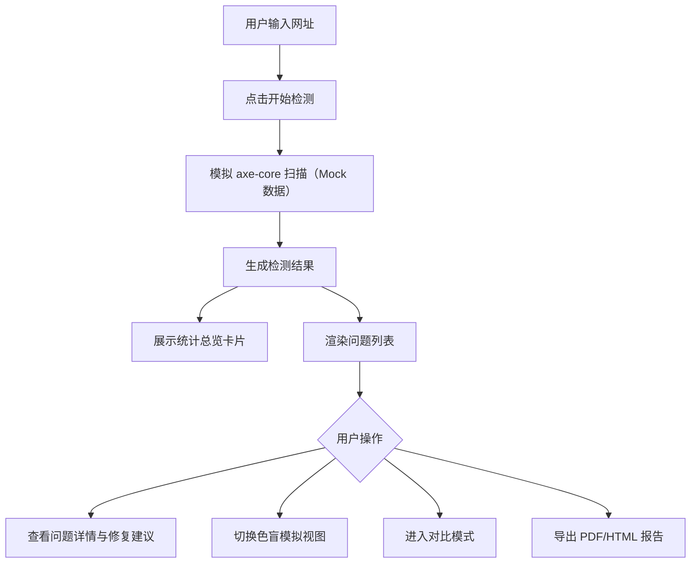

## 1. 产品概述
网页无障碍检测工具是一款基于 React 18 + TypeScript + axe-core 构建的前端应用，帮助开发者和无障碍审计人员快速检测网页的可访问性问题，提升网站对残障用户的友好程度。
- 核心价值：自动化检测 WCAG 标准违规，提供专业的修复建议，降低网站无障碍合规成本
- 目标用户：前端开发者、无障碍审计人员、产品经理、QA 测试人员

## 2. 核心功能

### 2.1 功能模块
1. **首页/检测页**：URL 输入、检测控制、检测结果展示、问题详情面板
2. **色盲模拟视图**：多种色盲类型模拟预览、实时切换
3. **对比模式**：修复前后检测结果对比、改进可视化
4. **报告导出**：PDF/HTML 格式导出检测报告

### 2.2 页面详情
| 页面名称 | 模块名称 | 功能描述 |
|-----------|-------------|---------------------|
| 检测首页 | URL 输入区 | 网址输入、检测按钮、加载状态、快速示例链接 |
| 检测首页 | 结果总览 | 检测统计（严重/警告/提示数量）、评分、检测时间 |
| 检测首页 | 问题列表 | 分类筛选、严重程度筛选、问题卡片列表 |
| 检测首页 | 问题详情 | WCAG 引用、问题描述、元素定位、修复建议、代码示例 |
| 检测首页 | 色盲模拟面板 | 色盲类型切换（红绿色盲、蓝黄色盲、全色盲）、预览画布 |
| 检测首页 | 对比模式面板 | 两次检测结果并排对比、差异高亮、改进统计 |
| 检测首页 | 报告导出区 | PDF 导出、HTML 导出、报告摘要 |

## 3. 核心流程
用户输入网址 → 系统模拟运行 axe-core 检测 → 生成 Mock 检测数据 → 展示统计总览和问题列表 → 用户筛选/点击查看详情 → 查看修复建议 → 切换色盲模拟模式 → 切换对比模式查看改进 → 导出 PDF/HTML 报告

## 4. 用户界面设计
### 4.1 设计风格
- 主色调：深青色（#0D9488）作为主色，搭配琥珀色（#F59E0B）警告色和玫红色（#E11D48）严重色
- 辅助色：天蓝色信息提示、深灰色中性色
- 字体：标题使用 Space Grotesk，正文使用 JetBrains Mono，突出技术工具感
- 卡片样式：圆角 12px，微妙阴影，悬停微动效
- 整体风格：深色模式为主、科技感、专业审计工具风格

### 4.2 页面设计概述
| 页面名称 | 模块名称 | UI 元素 |
|-----------|-------------|-------------|
| 检测首页 | Hero 输入区 | 大标题、渐变背景输入框、扫描按钮动效、检测进度条 |
| 检测首页 | 统计仪表盘 | 三色指标卡（严重/警告/提示）、环形进度评分、数据微动效 |
| 检测首页 | 问题列表 | 筛选标签栏、可折叠问题卡片、严重程度色标、元素代码片段 |
| 检测首页 | 详情抽屉 | 右侧滑入面板、WCAG 徽章、修复步骤列表、代码高亮块 |
| 检测首页 | 色盲预览 | 标签切换栏、原图/模拟图左右对照、实时滤镜效果 |
| 检测首页 | 对比视图 | 双栏布局、Before/After 标签、差异高亮条、改进统计箭头 |

### 4.3 响应式
- 桌面端优先（≥1280px），双栏/三栏布局
- 平板端（768-1279px）：单栏堆叠，抽屉式详情
- 移动端（<768px）：简化操作栏，折叠式筛选，全屏抽屉

### 4.4 动效与微交互
- 检测按钮点击：扫描线扫过动画 + 进度百分比
- 问题卡片展开：平滑高度过渡 + 箭头旋转
- 严重程度徽章：脉冲光晕动效
- 色盲切换：CSS filter 过渡 0.4s
- 页面加载：骨架屏 + 渐入
