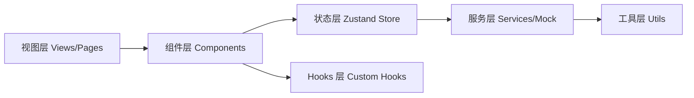

## 1. 架构设计
纯前端单页应用，状态集中管理，组件化分层设计。



## 2. 技术描述
- 前端：React@18 + TypeScript@5 + Vite@5
- 初始化工具：vite-init
- 样式：TailwindCSS@3 + CSS 变量
- 状态管理：zustand@4
- 路由：react-router-dom@6
- 图标：lucide-react
- 检测引擎：axe-core（Mock 数据模拟）
- PDF 导出：jsPDF + html2canvas
- 代码高亮：自定义 CSS
- 后端：无（纯前端 Mock）
- 数据库：无，使用 Mock 数据

## 3. 路由定义
| Route | 页面名称 | 用途 |
|-------|---------|------|
| / | 检测首页 | URL 输入、检测结果、色盲模拟、对比模式、报告导出 |

## 4. 数据模型定义

### 4.1 核心类型定义

```typescript
// 问题严重程度
type Severity = 'serious' | 'warning' | 'tip';

// 检测问题项
interface A11yIssue {
  id: string;
  type: string;               // 如 'image-alt', 'form-label', 'color-contrast'
  severity: Severity;
  title: string;
  description: string;
  wcagRefs: WcagRef[];        // WCAG 标准引用
  element: ElementLocator;    // 影响元素定位
  fixSuggestion: FixSuggestion;
  impact: string;             // 影响描述
}

interface WcagRef {
  code: string;               // 如 '1.1.1'
  name: string;               // 如 'Non-text Content'
  level: 'A' | 'AA' | 'AAA';
  url: string;
}

interface ElementLocator {
  selector: string;           // CSS 选择器
  html: string;               // HTML 片段
  xpath?: string;
}

interface FixSuggestion {
  steps: string[];            // 修复步骤
  codeBefore?: string;        // 示例前
  codeAfter?: string;         // 示例后
  resources?: string[];       // 参考资源
}

// 检测报告
interface ScanReport {
  id: string;
  url: string;
  scanTime: string;
  duration: number;           // 毫秒
  score: number;              // 0-100
  stats: {
    serious: number;
    warning: number;
    tip: number;
    total: number;
    passed: number;
  };
  issues: A11yIssue[];
  pageScreenshot?: string;    // Mock 数据占位
}

// 色盲类型
type ColorBlindType = 
  | 'protanopia'    // 红色盲
  | 'deuteranopia'  // 绿色盲
  | 'tritanopia'    // 蓝黄色盲
  | 'achromatopsia' // 全色盲
  | 'normal';       // 正常
```

### 4.2 Store 状态模型

```typescript
interface AppState {
  // 当前检测
  currentUrl: string;
  isScanning: boolean;
  scanProgress: number;
  currentReport: ScanReport | null;
  
  // 对比模式
  previousReport: ScanReport | null;
  compareMode: boolean;
  
  // UI 状态
  selectedIssueId: string | null;
  activeFilters: {
    severity: Severity[];
    categories: string[];
  };
  colorBlindMode: ColorBlindType;
  
  // Actions
  setUrl: (url: string) => void;
  startScan: () => Promise<void>;
  selectIssue: (id: string | null) => void;
  toggleSeverityFilter: (s: Severity) => void;
  setColorBlindMode: (m: ColorBlindType) => void;
  enterCompareMode: () => void;
  exitCompareMode: () => void;
  exportReport: (format: 'pdf' | 'html') => void;
}
```

## 5. 目录结构

```
src/
├── components/
│   ├── layout/
│   │   ├── Header.tsx
│   │   └── Container.tsx
│   ├── scan/
│   │   ├── UrlInput.tsx
│   │   ├── ScanProgress.tsx
│   │   └── ScanButton.tsx
│   ├── dashboard/
│   │   ├── StatsOverview.tsx
│   │   ├── ScoreRing.tsx
│   │   └── StatCard.tsx
│   ├── issues/
│   │   ├── IssueList.tsx
│   │   ├── IssueCard.tsx
│   │   ├── IssueDetail.tsx
│   │   ├── SeverityBadge.tsx
│   │   └── FilterBar.tsx
│   ├── colorblind/
│   │   ├── ColorBlindPreview.tsx
│   │   └── ColorBlindSwitch.tsx
│   ├── compare/
│   │   ├── CompareView.tsx
│   │   └── DiffHighlight.tsx
│   └── export/
│       └── ExportPanel.tsx
├── hooks/
│   ├── useScan.ts
│   └── useExport.ts
├── store/
│   └── useAppStore.ts
├── data/
│   └── mockData.ts
├── utils/
│   ├── scanSimulator.ts
│   ├── reportGenerator.ts
│   └── colorBlindFilters.ts
├── types/
│   └── index.ts
├── pages/
│   └── HomePage.tsx
├── App.tsx
├── main.tsx
└── index.css
```
